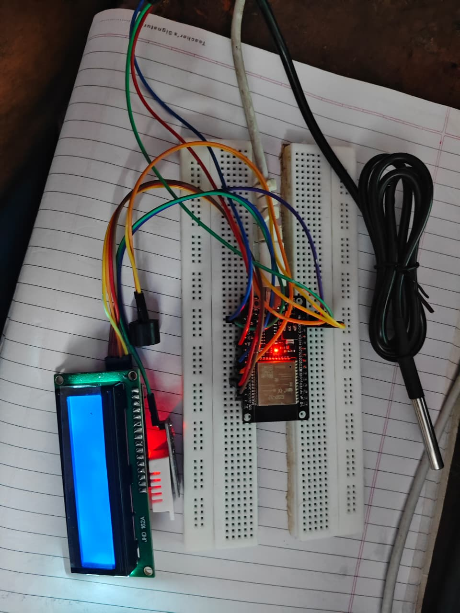
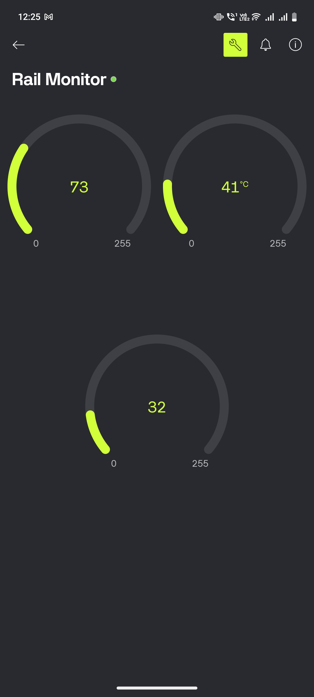

# 🚆 IoT-Enabled Real Time Rail Track Temperature Monitoring for Freeze and Heat Risk Prevention

## 📌 Abstract
Railway transportation remains a critical component of modern infrastructure, but extreme environmental conditions such as high heat and freezing temperatures can severely impact track integrity and operational safety. Excessive heat can lead to rail expansion and buckling, while extremely low temperatures may cause contraction and fractures, posing serious derailment risks.

This project presents an IoT-enabled real-time rail track temperature monitoring system designed to detect, analyze, and prevent such hazards. The system integrates DS18B20 temperature sensors with an ESP32 microcontroller to continuously monitor rail surface temperatures.

Data is transmitted to the cloud using IoT platforms like Blynk, enabling remote monitoring. The system performs threshold-based analysis to detect abnormal temperature variations and automatically generates alerts. This solution is cost-effective, scalable, and improves railway safety through proactive monitoring.

---

## ⚡ Features
- 📡 Real-time temperature monitoring
- 🌡️ Rail + air temperature sensing
- ☁️ Cloud integration using Blynk
- 🔔 Automatic alert system (buzzer + notification)
- 📊 Live data visualization
- 🔋 Energy-efficient (supports solar power)
- ⚠️ Threshold-based safety alerts

---

## 🔧 Hardware Components
- ESP32 Microcontroller  
- DS18B20 Temperature Sensor  
- DHT22 Temperature & Humidity Sensor  
- 16x2 LCD Display (I2C)  
- Buzzer  
- Power Supply (Battery / Solar optional)  

---

## 💻 Software & Technologies
- Arduino IDE  
- Embedded C / C++  
- ESP32 WiFi Module  
- Blynk IoT Platform  
- IoT Architecture  

---

## ⚙️ Working Principle
The DS18B20 sensor continuously measures the rail track temperature, while the DHT22 sensor captures ambient temperature and humidity.  

The ESP32 processes this data and sends it to the Blynk cloud platform via WiFi.  

If the rail temperature exceeds safe limits (above 40°C or below 5°C), the system:
- Activates a buzzer alert  
- Sends a notification through Blynk  

The LCD displays real-time sensor values locally, enabling both on-site and remote monitoring.

---

## 🔌 Circuit Diagram



---

## 📸 Output


- LCD Display Output  
- Blynk Dashboard Monitoring  

---

## 🚀 Future Enhancements
- 📍 GPS integration for location tracking  
- 🤖 AI-based predictive maintenance  
- 📶 LoRa / GSM for long-range communication  
- 🚆 Integration with railway control systems  
- 📊 Advanced analytics dashboard  

---

## 💡 Why This Project?
This system helps prevent railway accidents caused by extreme temperature variations by providing early warnings and real-time monitoring. It enhances safety, reduces maintenance costs, and supports smart transportation systems.

---

## 🛠️ Installation & Setup

1. Clone the repository:
```bash
git clone https://github.com/21sunitha/Rail-Track-Temperature-Monitoring.git
